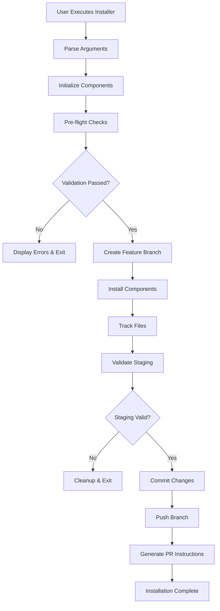
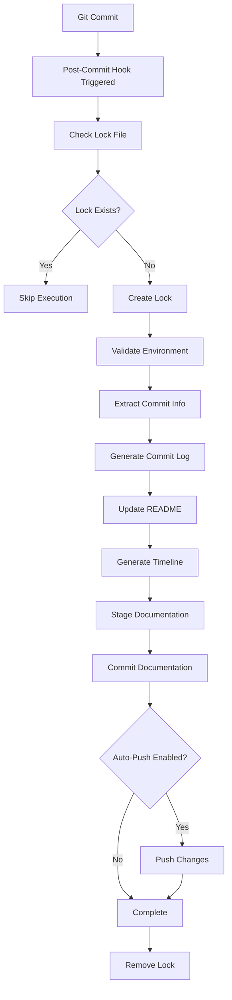

# System Architecture Documentation

This document provides a comprehensive overview of the Git Hooks Installer system architecture, including security components, data flow, and implementation details.

## Overview

The Git Hooks Installer is a security-first automation system that installs post-commit hooks to generate commit documentation while maintaining strict security controls and audit trails.

## High-Level Architecture

```
┌─────────────────────────────────────────────────────────────────────────────────┐
│                          Git Hooks Installer System                             │
├─────────────────────────────────────────────────────────────────────────────────┤
│                                                                                 │
│  ┌─────────────────┐    ┌──────────────────┐    ┌─────────────────────────────┐ │
│  │  User Interface │────│   Main Installer │────│      Security Layer        │ │
│  │                 │    │                  │    │                             │ │
│  │ • CLI Arguments │    │ • Pre-flight     │    │ • SecureGitWrapper          │ │
│  │ • Help System   │    │ • Installation   │    │ • FileTracker               │ │
│  │ • Status Check  │    │ • PR Generation  │    │ • RepositoryValidator       │ │
│  └─────────────────┘    └──────────────────┘    └─────────────────────────────┘ │
│           │                       │                            │                │
│           │                       │                            │                │
│  ┌─────────────────┐    ┌──────────────────┐    ┌─────────────────────────────┐ │
│  │ Developer Setup │    │   Git Hooks      │    │     Utility Functions      │ │
│  │                 │    │                  │    │                             │ │
│  │ • Manual Setup  │    │ • post-commit    │    │ • Timeline Generation       │ │
│  │ • Cross-platform│    │ • Lock Files     │    │ • README Updates            │ │
│  │ • Requirements  │    │ • UTF-8 Support  │    │ • Commit Processing         │ │
│  └─────────────────┘    └──────────────────┘    └─────────────────────────────┘ │
│                                   │                            │                │
│                                   │                            │                │
│                          ┌──────────────────┐    ┌─────────────────────────────┐ │
│                          │  Documentation  │    │       Test Suite            │ │
│                          │                  │    │                             │ │
│                          │ • Commit Logs    │    │ • User Story Tests          │ │
│                          │ • Timeline       │    │ • Multi-OS Validation       │ │
│                          │ • Branch Reports │    │ • Security Tests            │ │
│                          └──────────────────┘    └─────────────────────────────┘ │
└─────────────────────────────────────────────────────────────────────────────────┘
```

## Core Components

### 1. Main Installer (`git-hooks-installer.py`)

**Purpose:** Primary orchestration component that manages the entire installation process

**Key Features:**
- **Auto-Detection:** Automatically detects source directory using `Path(__file__).parent`
- **Feature Branching:** Creates timestamped branches: `feat/githooks-installation-<timestamp>`
- **Security Integration:** Uses all security components for safe operations
- **PR Workflow:** Generates platform-specific PR creation URLs

**Security Enhancements:**
```python
# Branch name validation
if not re.match(r'^[a-zA-Z0-9/_.-]+$', branch_name):
    raise SecurityError("Invalid branch name")

# Timeout protection
result = subprocess.run(cmd, timeout=30, shell=False)

# Error sanitization
logger.error("Operation failed")
logger.debug(f"Detailed error: {e}")  # Debug only
```

**Installation Flow:**
1. **Pre-flight Checks** → Repository validation, clean state verification
2. **Feature Branch Creation** → Secure branch creation with validation
3. **Component Installation** → Hooks, scripts, documentation, developer setup
4. **File Tracking** → All operations tracked via FileTracker
5. **Commit & Push** → Atomic commit of tracked files only
6. **PR Instructions** → Platform-specific PR creation guidance

### 2. Security Layer

#### SecureGitWrapper (`security/secure_git_wrapper.py`)

**Purpose:** Secure subprocess wrapper for all Git operations with comprehensive validation

**Security Features:**
```python
# Command whitelisting
ALLOWED_COMMANDS = {
    'status': ['--porcelain', '--show-stash'],
    'add': [],  # File paths validated separately
    'commit': ['-m', '--quiet'],
    'push': ['origin'],  # Branch names validated
    # ... more commands
}

# Validation pipeline
def run(self, git_command: str, *args: str) -> subprocess.CompletedProcess:
    self._validate_command(git_command, list(args))  # Command validation
    cmd = self._build_command(git_command, *args)    # Safe command building
    
    return subprocess.run(
        cmd, shell=False, timeout=self.timeout,      # Security measures
        env={**os.environ, 'GIT_TERMINAL_PROMPT': '0'}  # Disable prompts
    )
```

**Validation Mechanisms:**
- **Command Whitelisting:** Only approved Git commands allowed
- **Argument Validation:** Per-command argument restrictions
- **Path Sanitization:** Prevents directory traversal attacks
- **Branch Name Validation:** `^[a-zA-Z0-9/_.-]+$` pattern
- **Timeout Protection:** 30-second default timeout
- **Environment Control:** Disables interactive prompts

#### FileTracker (`security/file_tracker.py`)

**Purpose:** Tracks and validates all installer-created files for secure commits

**Resource Protection:**
```python
# Resource limits
MAX_FILES = 1000
MAX_DIRECTORIES = 100  
MAX_FILE_SIZE = 10 * 1024 * 1024      # 10MB per file
MAX_TOTAL_SIZE = 100 * 1024 * 1024    # 100MB total

def track_file_creation(self, file_path: str, category: str = "general"):
    if len(self.created_files) >= self.MAX_FILES:
        raise ValueError(f"Maximum file limit exceeded ({self.MAX_FILES})")
    
    full_path = self.repo_path / normalized_path
    if full_path.exists():
        file_size = full_path.stat().st_size
        if file_size > self.MAX_FILE_SIZE:
            raise ValueError(f"File too large: {normalized_path}")
```

**Atomic Operations:**
```python
def safe_add_tracked_files(self, skip_validation: bool = False) -> bool:
    # File locking for race condition prevention
    lock_file = open(self.repo_path / ".git" / "installer.lock", 'w')
    fcntl.flock(lock_file.fileno(), fcntl.LOCK_EX | fcntl.LOCK_NB)
    
    try:
        # Reset staging area for clean state
        subprocess.run(["git", "reset", "--quiet"])
        
        # Add files atomically
        if valid_files:
            subprocess.run(["git", "add", "--"] + valid_files)
            
        return self.validate_staging_area()
    finally:
        fcntl.flock(lock_file.fileno(), fcntl.LOCK_UN)
        lock_file.close()
```

#### RepositoryValidator (`security/repository_validator.py`)

**Purpose:** Comprehensive pre-flight safety checks before any operations

**Validation Pipeline:**
```python
def validate_all(self, branch_pattern: Optional[str] = None) -> bool:
    validations = [
        self.validate_git_repository(),      # .git directory exists
        self.validate_clean_working_tree(),  # No uncommitted changes
        self.validate_git_config(),          # User configuration set
    ]
    
    if branch_pattern:
        validations.append(
            self.validate_no_conflicting_branches(branch_pattern)
        )
    
    return all(validations)
```

**Security Checks:**
- **Repository Integrity:** Validates `.git` directory structure
- **Clean State:** Ensures no uncommitted changes
- **Configuration:** Validates git user settings
- **Branch Conflicts:** Prevents branch name collisions
- **Sensitive Files:** Detects potential secrets (`.env`, `*.key`, etc.)

### 3. Git Hooks System

#### Post-Commit Hook (`git-hooks/post-commit`)

**Purpose:** Automated documentation generation after each commit

**Security Enhancements:**
```bash
# Branch name validation
if ! [[ "$BRANCH_NAME" =~ ^[a-zA-Z0-9/_.-]+$ ]]; then
  echo "ERROR: Invalid branch name detected: $BRANCH_NAME"
  exit 1
fi

# Commit hash validation  
if ! [[ "$COMMIT_HASH" =~ ^[a-f0-9]{40}$ ]]; then
  echo "ERROR: Invalid commit hash detected"
  exit 1
fi

# Lock file for recursion prevention
MARKER_FILE=$(git rev-parse --git-path hooks/.post-commit.lock)
if [ -f "$MARKER_FILE" ]; then
  echo "🚫 Skipping post-commit actions to prevent recursion."
  exit 0
fi

# Safe execution with cleanup
touch "$MARKER_FILE"
trap 'rm -f "$MARKER_FILE"' EXIT
```

**Process Flow:**
1. **Lock Check** → Prevent recursive execution
2. **Validation** → Branch name, commit hash, environment
3. **Documentation** → Generate commit logs and timeline
4. **README Update** → Update branch-specific documentation
5. **Safe Commit** → Commit documentation with validation
6. **Optional Push** → Controlled by `GIT_AUTO_PUSH` environment variable

#### Utility Scripts

**Timeline Generation (`scripts/post-commit/generate_git_timeline.py`):**
```python
def generate_git_timeline():
    branch_name = os.getenv("BRANCH_NAME")
    
    # Input validation
    if not re.match(r'^[a-zA-Z0-9/_.-]+$', branch_name):
        print(f"❌ ERROR: Invalid branch name: {branch_name}")
        sys.exit(1)
    
    # Path containment verification
    assert_inside_repo(Path(log_dir), Path(repo_root), "Timeline output directory")
```

**Git Operations (`scripts/post-commit/githooks_utils.py`):**
```python
def run_git_command(command):
    # Command validation
    if not command or command[0] != "git":
        print("❌ ERROR: Only git commands are allowed")
        sys.exit(1)
    
    # Timeout protection
    result = subprocess.run(
        command, timeout=30,
        env={**os.environ, 'GIT_TERMINAL_PROMPT': '0'}
    )
```

### 4. Developer Setup System

#### Manual Setup (`developer-setup/setup_githooks.py`)

**Purpose:** Cross-platform developer setup with interactive configuration

**Security Features:**
```python
def check_git_config():
    name = input("Enter your name: ").strip()
    
    # Name validation
    if not re.match(r'^[a-zA-Z\s.-]+$', name):
        print_color("Invalid name format", Colors.RED)
        return False
    
    email = input("Enter your email: ").strip()
    
    # Email validation
    email_pattern = r'^[a-zA-Z0-9._%+-]+@[a-zA-Z0-9.-]+\.[a-zA-Z]{2,}$'
    if not re.match(email_pattern, email):
        print_color("Invalid email format", Colors.RED)
        return False
```

**Cross-Platform Support:**
- **Shell Scripts:** Linux/macOS wrapper scripts
- **PowerShell:** Windows-compatible scripts  
- **Python Detection:** Automatic Python version detection
- **Dependency Management:** Requirements.txt integration

### 5. Documentation System

#### Automated Documentation Generation

**Commit Logs Structure:**
```
docs/
└── commit-logs/
    └── {branch-name}/
        ├── README.md                    # Branch summary
        ├── git_timeline_report.md      # Comprehensive timeline
        ├── {commit-hash-8}.md          # Individual commit logs
        └── .installation-manifest.json  # Installation audit trail
```

**Content Generation:**
- **Individual Commit Logs:** Detailed commit information with file changes
- **Branch README:** Tabular summary with links to individual commits
- **Timeline Reports:** Comprehensive project history with branches, tags, PRs
- **Installation Manifests:** Complete audit trail of installer actions

### 6. Testing Infrastructure

#### Multi-OS Testing (`tests/`)

**Docker-Based Validation:**
- **Ubuntu 22.04:** Primary Linux distribution testing
- **AlmaLinux 9/10:** Enterprise Linux compatibility
- **User Story Tests:** Business requirement validation
- **Security Tests:** Vulnerability validation

**Test Categories:**
```bash
# Comprehensive multi-OS testing
./run_docker-tests.sh

# User Story validation
docker-compose -f tests/docker/docker-compose.user-story-tests.yml up

# Security testing
docker-compose -f tests/docker/docker-compose.check-tests.yml up
```

## Data Flow Architecture

### Installation Process Flow



### Post-Commit Documentation Flow



## Security Architecture

### Defense in Depth Strategy

```
┌─────────────────────────────────────────────────────────────────────────────────┐
│                          Security Layers                                        │
├─────────────────────────────────────────────────────────────────────────────────┤
│                                                                                 │
│  Layer 1: Input Validation                                                     │
│  ├─ Command line argument validation                                           │
│  ├─ Branch name pattern matching: ^[a-zA-Z0-9/_.-]+$                          │
│  ├─ Email format validation                                                    │
│  └─ Path traversal prevention                                                  │
│                                                                                 │
│  Layer 2: Process Isolation                                                    │
│  ├─ shell=False for all subprocess calls                                       │
│  ├─ Command whitelisting in SecureGitWrapper                                   │
│  ├─ Timeout protection (5-30 seconds)                                          │
│  └─ Environment variable sanitization                                          │
│                                                                                 │
│  Layer 3: File System Security                                                 │
│  ├─ Path containment verification                                              │
│  ├─ realpath() resolution for symlink protection                               │
│  ├─ File size and count limits                                                 │
│  └─ Atomic operations with file locking                                        │
│                                                                                 │
│  Layer 4: Git Operation Security                                               │
│  ├─ Only tracked files committed (FileTracker)                                 │
│  ├─ Staging area validation                                                    │
│  ├─ Branch creation validation                                                 │
│  └─ Repository state verification                                              │
│                                                                                 │
│  Layer 5: Information Security                                                 │
│  ├─ Error message sanitization                                                 │
│  ├─ Debug vs. production logging                                               │
│  ├─ Sensitive file detection                                                   │
│  └─ Audit trail generation                                                     │
│                                                                                 │
└─────────────────────────────────────────────────────────────────────────────────┘
```

### Threat Model Coverage

| **Threat Category** | **Specific Threats** | **Mitigations** |
|-------------------|-------------------|----------------|
| **Code Injection** | Command injection via branch names | Input validation, command whitelisting |
| **Path Traversal** | Directory traversal attacks | Path sanitization, realpath() validation |
| **Race Conditions** | TOCTOU in file operations | File locking, atomic operations |
| **Resource Exhaustion** | DoS via large files/operations | Resource limits, timeouts |
| **Information Disclosure** | Sensitive data in error messages | Error sanitization, structured logging |
| **Privilege Escalation** | Malicious git operations | Git command validation, secure wrapper |
| **Data Integrity** | Unintended file commits | File tracking, staging validation |

## Performance Characteristics

### Resource Utilization

| **Component** | **Memory Usage** | **CPU Usage** | **Disk I/O** | **Network** |
|-------------|----------------|-------------|-------------|-------------|
| Main Installer | 10-20MB | Low | Medium | Low |
| Post-Commit Hook | 5-10MB | Low | Low | Optional |
| File Tracker | 2-5MB | Low | Low | None |
| Security Components | 1-3MB each | Low | Low | None |

### Scalability Limits

- **Maximum Files:** 1,000 files per installation
- **Maximum Directories:** 100 directories per installation  
- **File Size Limit:** 10MB per individual file
- **Total Size Limit:** 100MB total tracked content
- **Timeout Limits:** 5-30 seconds per operation
- **Concurrent Operations:** File locking prevents conflicts

## Configuration Management

### Environment Variables

| **Variable** | **Purpose** | **Default** | **Security Impact** |
|------------|-----------|-----------|------------------|
| `GIT_AUTO_PUSH` | Enable automatic push | `false` | Low (feature flag) |
| `GIT_TERMINAL_PROMPT` | Disable git prompts | `0` | High (prevents hangs) |
| `BRANCH_NAME` | Current branch context | Auto-detected | High (injection vector) |
| `REPO_ROOT` | Repository root path | Auto-detected | High (path traversal) |

### Runtime Configuration

```python
# FileTracker limits (configurable)
MAX_FILES = 1000
MAX_DIRECTORIES = 100
MAX_FILE_SIZE = 10 * 1024 * 1024
MAX_TOTAL_SIZE = 100 * 1024 * 1024

# SecureGitWrapper timeouts
DEFAULT_TIMEOUT = 30  # seconds
VALIDATION_TIMEOUT = 10  # seconds

# Branch name validation
BRANCH_NAME_PATTERN = r'^[a-zA-Z0-9/_.-]+$'
MAX_BRANCH_NAME_LENGTH = 255
```

## Monitoring and Observability

### Logging Architecture

```python
# Structured logging levels
logging.DEBUG    # Detailed technical information (development)
logging.INFO     # General operational information (production)
logging.WARNING  # Important notices (always shown)
logging.ERROR    # Error conditions (always shown)
logging.CRITICAL # System-threatening errors (always shown)

# Example usage
logger.info("✅ Installation completed successfully")           # User-facing
logger.debug(f"Branch creation details: {branch_details}")     # Debug only
logger.error("Failed to create feature branch")                # Sanitized
logger.debug(f"Branch creation error: {detailed_error}")       # Full details
```

### Audit Trail

**Installation Manifest Example:**
```json
{
  "installer_version": "1.1.0",
  "timestamp": "2025-01-15T10:30:45",
  "duration_seconds": 12.34,
  "files_created": 25,
  "files_modified": 3,
  "directories_created": 8,
  "created_files": ["scripts/post-commit/...", "..."],
  "safety_validation": {
    "only_tracked_files_committed": true,
    "no_user_files_included": true,
    "repository_state_validated": true
  }
}
```

### Health Checks

Built-in status checking via `--check` flag:
```bash
python git-hooks-installer.py --check
```

Validates:
- ✅ Post-commit hook installation and permissions
- ✅ Scripts directory structure
- ✅ Developer setup components
- ✅ Shell wrapper scripts
- ✅ Documentation structure
- ✅ Git configuration

---

**Document Version:** 1.0  
**Last Updated:** 2025-01-15  
**Architecture Review Date:** 2025-04-15  
**Contact:** architecture@development-toolbox.org