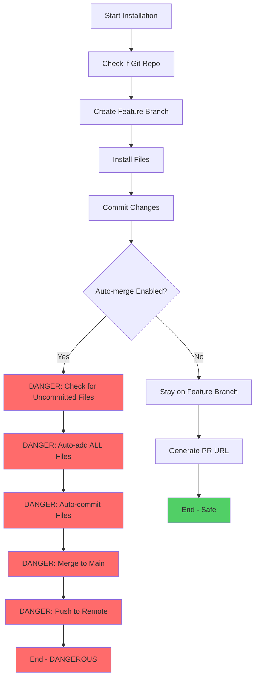
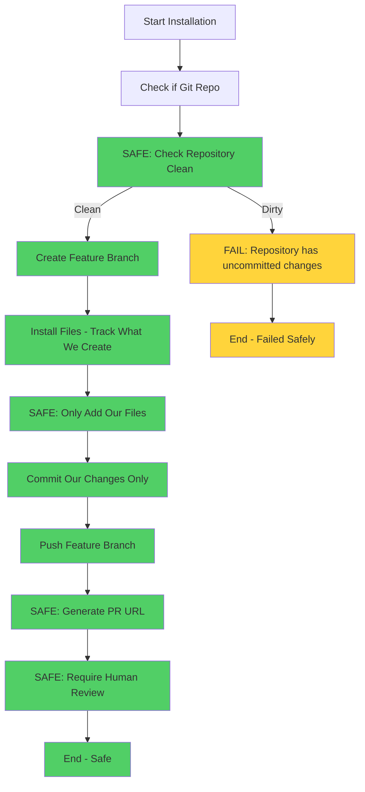

# 🚨 CRITICAL: Fix Dangerous Git Operations in Installer

**Date Created**: 2025-07-24  
**Status**: 🔴 CRITICAL - Immediate Fix Required  
**Priority**: CRITICAL  

## ⚠️ DANGEROUS BEHAVIORS IDENTIFIED

### 1. **Auto-merge to Main Branch**
**Location**: `git-hooks-installer-fixed.py:807-811`
```python
if branch_name and auto_merge:
    logger.info(f"🔀 Auto-merging to {original_branch}...")
```
**Risk**: Bypasses PR review process, changes go directly to main

### 2. **Auto-commits Uncommitted Files**
**Location**: `git-hooks-installer-fixed.py:594-607, 814-820`
```python
# Commit any uncommitted changes on main
for file in additional_files:
    run_git_command(repo_path, ["add", file])  # Essentially git add .
```
**Risk**: Commits user's unrelated files, secrets, work-in-progress

### 3. **Indiscriminate File Adding**
```python
if line.startswith('??') or line.startswith('A ') or line.startswith('M '):
    file_path = line[3:].strip()
    additional_files.append(file_path)
```
**Risk**: Adds ANY untracked/modified files without user consent

## CURRENT PROGRAM LOGIC DIAGRAM



## REQUIRED FIXES

### 1. **Remove Auto-merge Functionality**
- ✅ Always create PR instead of merging
- ✅ Never merge directly to main
- ✅ Always require human review

### 2. **Stop Auto-committing User Files**
- ✅ Never use `git add` on unrelated files
- ✅ Only commit installer-created files
- ✅ Fail fast if repository is dirty

### 3. **Strict File Management**
- ✅ Only add files that the installer explicitly created
- ✅ Use whitelist approach, not blacklist
- ✅ Pre-validate repository state

## SAFE PROGRAM LOGIC (PROPOSED)



## IMPLEMENTATION REQUIREMENTS

### 1. **Pre-flight Checks**
```python
def validate_repository_state(repo_path: Path) -> bool:
    """Ensure repository is in clean state before installation."""
    status = run_git_command(repo_path, ["status", "--porcelain"])
    if status.stdout.strip():
        logger.error("❌ Repository has uncommitted changes. Please commit or stash first.")
        return False
    return True
```

### 2. **File Tracking**
```python
class InstallerFileTracker:
    def __init__(self):
        self.created_files = []
        self.modified_files = []
    
    def track_created(self, file_path: str):
        self.created_files.append(file_path)
    
    def get_files_to_commit(self) -> List[str]:
        return self.created_files  # Only our files
```

### 3. **PR-Only Workflow**
```python
def create_pull_request_workflow(repo_path: Path, branch_name: str):
    """Create PR instead of auto-merge."""
    push_changes(repo_path, branch_name)
    generate_pr_url(repo_path, branch_name)
    logger.info("🔄 Please review and merge the pull request")
```

## TEST VALIDATION REQUIRED

- [ ] Test with dirty repository (should fail)
- [ ] Test with untracked files (should not add them)
- [ ] Test PR creation instead of merge
- [ ] Validate only installer files are committed
- [ ] Test failure scenarios and cleanup

## IMPACT ASSESSMENT

**Current State**: 🔴 **DANGEROUS**
- Can commit user secrets
- Can overwrite user work
- Bypasses code review
- Violates git best practices

**Required State**: ✅ **SAFE**
- Only commits installer files
- Always requires PR review
- Fails safely on dirty repository
- Follows git best practices

---

**This is a CRITICAL security and safety issue that must be fixed before any production use.**