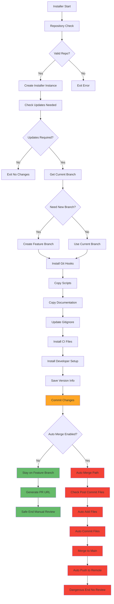

# Current Installer Logic Analysis & Safety Assessment

**Date Created**: 2025-07-24  
**Status**: 🔴 CRITICAL ANALYSIS - Dangerous Code Identified  
**Priority**: CRITICAL  

## CURRENT PROGRAM FLOW DIAGRAM



## DETAILED CODE FLOW ANALYSIS

### 1. **Entry Point & Setup** ✅ SAFE
```python
def setup_git_hooks(target_repo, source_dir, auto_merge=False, push=True, force=False, no_ci=False)
```
- Validates repository
- Creates installer instance
- Checks for updates

### 2. **Branch Creation** ⚠️ CONDITIONAL RISK
```python
# Lines 679-687
if need_branch:
    branch_name = f"feat/update-githooks-installation-{timestamp}"
    original_branch = get_current_branch(target_repo)
    run_git_command(target_repo, ["checkout", "-b", branch_name])
```
**Risk**: Creates feature branch even if `auto_merge=True`

### 3. **File Installation** ✅ SAFE
- Installs hooks to `.git/hooks/` (not tracked)
- Copies scripts, docs, developer-setup
- Updates .gitignore, CI/CD files
- **Only adds files the installer creates**

### 4. **Commit Phase** ✅ MOSTLY SAFE
```python
# Lines 785-786
if commit_changes(target_repo, commit_message, files_to_commit):
    logger.info("✅ Changes committed successfully")
```
**Safe**: Only commits files installer explicitly created

### 5. **🚨 DANGEROUS AUTO-MERGE PATH** 🔴 CRITICAL RISK
```python
# Lines 807-830
if branch_name and auto_merge:
    # Check for post-commit hook created files
    status_result = run_git_command(target_repo, ["status", "--porcelain"])
    if status_result.stdout.strip():
        additional_files = []
        for line in status_result.stdout.strip().split('\n'):
            if line.startswith('??') or line.startswith('A '):
                file_path = line[3:].strip()
                additional_files.append(file_path)
                
        # 🚨 DANGER: Auto-add files
        for file in additional_files:
            run_git_command(repo_path, ["add", file])
        
        # 🚨 DANGER: Auto-commit without user consent
        run_git_command(repo_path, ["commit", "-m", "docs: Add post-commit generated documentation"])
```

### 6. **🚨 MERGE FUNCTION** 🔴 CRITICAL RISK
```python
def merge_branch(repo_path: Path, source_branch: str, target_branch: str) -> bool:
    # Switch to main
    run_git_command(repo_path, ["checkout", target_branch])
    
    # 🚨 DANGER: Auto-add ANY uncommitted files
    for line in status_result.stdout.strip().split('\n'):
        if line.startswith('??') or line.startswith('A ') or line.startswith('M '):
            file_path = line[3:].strip()
            additional_files.append(file_path)
    
    for file in additional_files:
        run_git_command(repo_path, ["add", file])  # Essentially git add .
    
    # 🚨 DANGER: Direct merge to main
    run_git_command(repo_path, ["merge", source_branch, "--no-ff"])
```

## TEST RESULTS ANALYSIS

### What Tests Validated ✅
- ✅ Directory creation works
- ✅ File installation works  
- ✅ Shell scripts work
- ✅ Version tracking works
- ✅ Auto-merge "works" (but dangerous!)

### What Tests DID NOT Validate ⚠️
- ❌ Safety with dirty repository
- ❌ User file protection
- ❌ PR workflow instead of auto-merge
- ❌ Behavior with untracked user files
- ❌ Security with secrets in repository

### Why Tests Passed Despite Dangers
1. **Clean Docker Environment**: No user files to accidentally commit
2. **Controlled Setup**: Repository started empty
3. **Expected Post-commit Files**: Only installer-generated files present
4. **No User Work**: No risk of overwriting user changes

## REAL-WORLD RISK SCENARIOS

### Scenario 1: Developer's Working Repository
```bash
# Developer has uncommitted work
$ git status
On branch main
Changes not staged for commit:
  modified:   src/secrets.env  # Contains API keys
Untracked files:
  temp-debug.py               # Debug script with passwords
  .env                        # Environment secrets

# Installer runs with --auto-merge
# 🚨 RESULT: Commits secrets.env, temp-debug.py, .env to main branch
# 🚨 PUSHES TO REMOTE: Secrets now in git history
```

### Scenario 2: Feature Branch Work
```bash
# User is on feature branch with WIP
$ git branch
* feature/user-work
  main

# Installer auto-merges to main
# 🚨 RESULT: User's unfinished work merged without review
# 🚨 BYPASSES: Code review, testing, CI/CD gates
```

## REQUIRED IMMEDIATE FIXES

### 1. **Remove Auto-merge Entirely**
```python
# DELETE this entire section
if branch_name and auto_merge:
    # ... dangerous code ...
```

### 2. **Add Repository State Validation**
```python
def validate_clean_repository(repo_path: Path) -> bool:
    status = run_git_command(repo_path, ["status", "--porcelain"])
    if status.stdout.strip():
        logger.error("❌ Repository has uncommitted changes:")
        for line in status.stdout.strip().split('\n'):
            logger.error(f"   {line}")
        logger.error("Please commit or stash changes before running installer.")
        return False
    return True
```

### 3. **Always Create PR**
```python
def finish_installation(repo_path: Path, branch_name: str):
    if branch_name:
        push_changes(repo_path, branch_name) 
        pr_url = generate_pr_url(repo_path, branch_name)
        logger.info(f"📝 Please review and merge: {pr_url}")
        logger.info("🔄 Installation complete - awaiting review")
```

## FINAL ASSESSMENT

**Current Status**: 🔴 **PRODUCTION UNSAFE**
- Can commit user secrets
- Can merge without review  
- Can overwrite user work
- Violates security best practices

**Required Status**: ✅ **PRODUCTION SAFE**
- Only commits installer files
- Always requires PR review
- Validates clean repository
- Follows security best practices

---

**RECOMMENDATION: DO NOT USE --auto-merge flag until these critical security issues are resolved.**