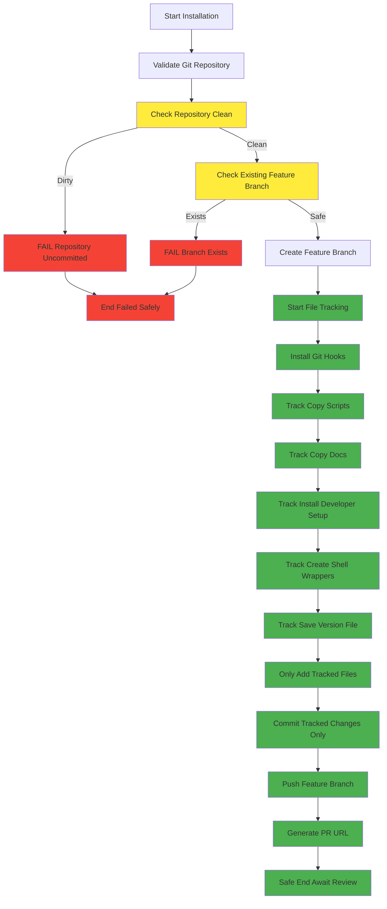

# Safe Installer Implementation Proposal

**Date Created**: 2025-07-24  
**Status**: 🟡 PROPOSAL - Safe Implementation Design  
**Priority**: HIGH  

## PROPOSED SAFE PROGRAM FLOW



## IMPLEMENTATION DESIGN

### 1. **Pre-flight Safety Checks**

```python
class RepositoryValidator:
    def __init__(self, repo_path: Path):
        self.repo_path = repo_path
        
    def validate_clean_state(self) -> bool:
        """Ensure repository has no uncommitted changes."""
        status = run_git_command(self.repo_path, ["status", "--porcelain"])
        if status.stdout.strip():
            logger.error("❌ Repository has uncommitted changes:")
            self._show_status_details(status.stdout)
            logger.error("Please commit or stash changes before installation.")
            return False
        return True
    
    def validate_no_existing_branch(self, branch_name: str) -> bool:
        """Ensure feature branch doesn't already exist."""
        result = run_git_command(self.repo_path, ["branch", "--list", branch_name], check=False)
        if result.stdout.strip():
            logger.error(f"❌ Branch '{branch_name}' already exists.")
            logger.error("Please delete or rename the existing branch.")
            return False
        return True
    
    def validate_remote_sync(self) -> bool:
        """Warn if local branch is behind remote."""
        try:
            run_git_command(self.repo_path, ["fetch", "origin"], check=False)
            status = run_git_command(self.repo_path, ["status", "-uno"], check=False)
            if "behind" in status.stdout:
                logger.warning("⚠️ Local branch is behind remote. Consider pulling first.")
                return False
        except:
            pass  # No remote or fetch failed - not critical
        return True
```

### 2. **File Tracking System**

```python
class SafeFileTracker:
    def __init__(self):
        self.created_files: List[str] = []
        self.modified_files: List[str] = []
        self.directories_created: List[str] = []
    
    def track_file_creation(self, file_path: str):
        """Track files created by installer."""
        self.created_files.append(file_path)
        logger.debug(f"📝 Tracked created: {file_path}")
    
    def track_file_modification(self, file_path: str):
        """Track files modified by installer."""
        self.modified_files.append(file_path)
        logger.debug(f"📝 Tracked modified: {file_path}")
    
    def track_directory_creation(self, dir_path: str):
        """Track directories created by installer."""
        self.directories_created.append(dir_path)
        logger.debug(f"📝 Tracked directory: {dir_path}")
    
    def get_files_to_commit(self) -> List[str]:
        """Return only files that installer created/modified."""
        return self.created_files + self.modified_files
    
    def validate_no_extra_files(self, repo_path: Path) -> bool:
        """Ensure no unexpected files are staged."""
        status = run_git_command(repo_path, ["status", "--porcelain"])
        staged_files = []
        
        for line in status.stdout.strip().split('\n'):
            if line and (line.startswith('A ') or line.startswith('M ')):
                staged_files.append(line[3:].strip())
        
        tracked_files = set(self.get_files_to_commit())
        staged_files_set = set(staged_files)
        
        unexpected = staged_files_set - tracked_files
        if unexpected:
            logger.error(f"❌ Unexpected files staged: {unexpected}")
            return False
        return True
```

### 3. **Safe Installation Process**

```python
def safe_setup_git_hooks(
        target_repo: Path,
        source_dir: Path,
        force: bool = False,
        no_ci: bool = False):
    """
    Safe git hooks installation with strict file tracking.
    
    REMOVED PARAMETERS:
    - auto_merge: Always requires manual PR review
    - push: Always pushes feature branch for PR
    """
    
    # 1. Initialize safety systems
    validator = RepositoryValidator(target_repo)
    tracker = SafeFileTracker()
    
    # 2. Pre-flight safety checks
    if not validator.validate_clean_state():
        return False
    
    # 3. Create safe feature branch
    timestamp = datetime.now().strftime("%Y%m%d-%H%M%S")
    branch_name = f"feat/update-githooks-installation-{timestamp}"
    
    if not validator.validate_no_existing_branch(branch_name):
        return False
    
    original_branch = get_current_branch(target_repo)
    run_git_command(target_repo, ["checkout", "-b", branch_name])
    logger.info(f"✅ Created feature branch: {branch_name}")
    
    try:
        # 4. Install with strict tracking
        installer = SafeGitHooksInstaller(target_repo, source_dir, tracker)
        
        # Install each component with tracking
        installer.install_git_hooks()  # .git/hooks/ - not tracked by git
        installer.install_scripts()    # Track created files
        installer.install_docs()       # Track created files  
        installer.install_developer_setup()  # Track created files
        installer.create_shell_wrappers()    # Track created files
        installer.save_version_info()        # Track created files
        
        # 5. Safe commit process
        files_to_commit = tracker.get_files_to_commit()
        if not files_to_commit:
            logger.info("ℹ️ No changes to commit")
            return True
        
        # Only add files we explicitly created
        for file_path in files_to_commit:
            run_git_command(target_repo, ["add", file_path])
            logger.info(f"📝 Added: {file_path}")
        
        # Validate staging area matches our expectations
        if not tracker.validate_no_extra_files(target_repo):
            logger.error("❌ Staging area contains unexpected files!")
            return False
        
        # Commit with detailed message
        commit_message = create_detailed_commit_message(tracker)
        run_git_command(target_repo, ["commit", "-m", commit_message])
        logger.info("✅ Changes committed successfully")
        
        # 6. Push and create PR
        run_git_command(target_repo, ["push", "origin", branch_name])
        logger.info(f"✅ Pushed branch: {branch_name}")
        
        # Generate PR URL
        pr_url = generate_pr_url(target_repo, branch_name, original_branch)
        if pr_url:
            logger.info(f"📝 Create pull request: {pr_url}")
        
        logger.info("🎉 Installation complete!")
        logger.info(f"🔄 Please review and merge the pull request")
        logger.info(f"🚀 Branch: {branch_name}")
        
        return True
        
    except Exception as e:
        logger.error(f"❌ Installation failed: {e}")
        # Clean up: return to original branch
        run_git_command(target_repo, ["checkout", original_branch], check=False)
        run_git_command(target_repo, ["branch", "-D", branch_name], check=False)
        return False
```

### 4. **Safe File Operations**

```python
class SafeGitHooksInstaller:
    def __init__(self, target_repo: Path, source_dir: Path, tracker: SafeFileTracker):
        self.target_repo = target_repo
        self.source_dir = source_dir
        self.tracker = tracker
    
    def install_scripts(self):
        """Install scripts with strict tracking."""
        scripts_src = self.source_dir / "scripts"
        scripts_dst = self.target_repo / "scripts"
        
        if not scripts_src.exists():
            return
        
        # Create directory
        scripts_dst.mkdir(parents=True, exist_ok=True)
        self.tracker.track_directory_creation("scripts")
        
        # Copy files with tracking
        for src_file in scripts_src.rglob("*"):
            if src_file.is_file():
                rel_path = src_file.relative_to(scripts_src)
                dst_file = scripts_dst / rel_path
                
                # Ensure parent directory exists
                dst_file.parent.mkdir(parents=True, exist_ok=True)
                
                # Copy file
                shutil.copy2(src_file, dst_file)
                
                # Track the file
                self.tracker.track_file_creation(f"scripts/{rel_path}")
                logger.info(f"📄 Installed: scripts/{rel_path}")
```

## SAFETY GUARANTEES

### ✅ **What This Implementation Guarantees**

1. **No Unintended File Commits**
   - Only commits files explicitly created by installer
   - Validates staging area before commit
   - Fails if unexpected files found

2. **Clean Repository Requirement**
   - Pre-flight check ensures no uncommitted changes
   - User must handle their work before installation
   - No risk of committing user files

3. **Always Requires Review**
   - Never merges directly to main
   - Always creates PR for human review
   - Follows proper git workflow

4. **Predictable Behavior** 
   - Detailed logging of every operation
   - Tracks exactly what files are modified
   - Clean error handling and rollback

5. **No Surprises**
   - Clear validation messages
   - Explicit user actions required
   - No automatic file handling

### ❌ **What This Implementation Prevents**

1. **No Auto-merge to Main**
2. **No Committing User Files**
3. **No Working on Dirty Repository**
4. **No Bypassing Code Review**
5. **No Unexpected File Modifications**

## MIGRATION PATH

### Phase 1: Fix Critical Issues
- Remove auto-merge functionality
- Add repository validation
- Implement file tracking

### Phase 2: Enhanced Safety
- Add comprehensive pre-flight checks
- Implement safe file operations
- Add detailed logging

### Phase 3: Production Ready
- Full test coverage for safety features
- Documentation for safe usage
- Integration with CI/CD workflows

---

**This implementation prioritizes safety over convenience, ensuring no accidental damage to user repositories.**