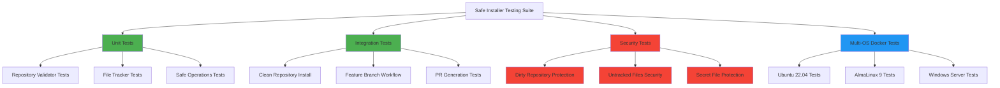

# Safe Installer Testing Strategy

**Date Created**: 2025-07-24  
**Status**: 🟡 PROPOSAL - Testing Environment Design  
**Priority**: HIGH  

## TESTING REQUIREMENTS FOR SAFE INSTALLER

The safe installer implementation requires comprehensive testing to validate:
1. **Safety Mechanisms** - Repository validation, file tracking
2. **Failure Scenarios** - Dirty repository, existing branches
3. **Security** - No unintended file commits
4. **Cross-Platform** - Windows, Linux, macOS compatibility

## PROPOSED TESTING ARCHITECTURE



## DOCKER TESTING ENVIRONMENTS

### 1. **Base Safe Testing Environment**

```dockerfile
# Dockerfile.safe-installer-test
FROM ubuntu:22.04

# Install required packages
RUN apt-get update && apt-get install -y \
    software-properties-common \
    && add-apt-repository ppa:deadsnakes/ppa -y \
    && apt-get update && apt-get install -y \
    python3.12 python3.12-venv python3.12-dev \
    python3-pip git make curl tree \
    && rm -rf /var/lib/apt/lists/*

# Configure git
RUN git config --global user.email "safe-test@example.com" && \
    git config --global user.name "Safe Test User" && \
    git config --global init.defaultBranch main

WORKDIR /app
COPY git-hooks-installer/ /app/git-hooks-installer/

# Install Python dependencies
RUN python3.12 -m venv /venv && \
    /venv/bin/pip install --upgrade pip && \
    if [ -f /app/git-hooks-installer/requirements.txt ]; then \
        /venv/bin/pip install -r /app/git-hooks-installer/requirements.txt; \
    fi

# Copy test scripts
COPY tests/docker/test-safe-installer.sh /app/test-safe-installer.sh
RUN chmod +x /app/test-safe-installer.sh

CMD ["/app/test-safe-installer.sh"]
```

### 2. **Security Testing Environment**

```dockerfile
# Dockerfile.security-test
FROM ubuntu:22.04

# Same base setup as above...

# Create test scenarios with sensitive files
RUN mkdir -p /security-test-repo && \
    cd /security-test-repo && \
    git init && \
    echo "# Security Test Repo" > README.md && \
    git add README.md && \
    git commit -m "Initial commit" && \
    echo "API_KEY=secret123" > .env && \
    echo "password=admin123" > config.txt && \
    echo "debug_info" > temp.log

CMD ["/app/test-security-scenarios.sh"]
```

## COMPREHENSIVE TEST SUITE

### 1. **Safe Installation Tests** (`test-safe-installer.sh`)

```bash
#!/bin/bash
set -e

# Test 1: Clean Repository Installation
test_clean_installation() {
    echo "=== TEST 1: Clean Repository Installation ==="
    
    # Create clean test repo
    mkdir -p /test-repo-clean
    cd /test-repo-clean
    git init
    echo "# Test Repository" > README.md
    git add README.md
    git commit -m "Initial commit"
    
    # Run safe installer
    python3 /app/git-hooks-installer/git-hooks-installer-safe.py \
        --source /app/git-hooks-installer \
        .
    
    # Validate results
    validate_clean_installation
}

# Test 2: Dirty Repository Protection
test_dirty_repository_protection() {
    echo "=== TEST 2: Dirty Repository Protection ==="
    
    # Create dirty test repo
    mkdir -p /test-repo-dirty
    cd /test-repo-dirty
    git init
    echo "# Test Repository" > README.md
    git add README.md
    git commit -m "Initial commit"
    
    # Add uncommitted changes
    echo "uncommitted work" > work.txt
    echo "modified" >> README.md
    
    # Run safe installer (should fail)
    if python3 /app/git-hooks-installer/git-hooks-installer-safe.py \
        --source /app/git-hooks-installer \
        . 2>/dev/null; then
        echo "❌ FAIL: Installer should have rejected dirty repository"
        exit 1
    else
        echo "✅ PASS: Installer correctly rejected dirty repository"
    fi
}

# Test 3: Existing Branch Protection
test_existing_branch_protection() {
    echo "=== TEST 3: Existing Branch Protection ==="
    
    # Create repo with existing feature branch
    mkdir -p /test-repo-branch
    cd /test-repo-branch
    git init
    echo "# Test Repository" > README.md
    git add README.md
    git commit -m "Initial commit"
    
    # Create conflicting branch
    git checkout -b feat/update-githooks-installation-20250724-000000
    git checkout main
    
    # Run safe installer (should detect existing branch)
    # Implementation should check for existing branches with similar names
    validate_branch_protection
}

# Test 4: File Tracking Validation
test_file_tracking() {
    echo "=== TEST 4: File Tracking Validation ==="
    
    # Create test repo
    mkdir -p /test-repo-tracking
    cd /test-repo-tracking
    git init
    echo "# Test Repository" > README.md
    git add README.md
    git commit -m "Initial commit"
    
    # Add untracked files that should NOT be committed
    echo "user secret" > .secret
    echo "debug info" > debug.log
    
    # Run safe installer
    python3 /app/git-hooks-installer/git-hooks-installer-safe.py \
        --source /app/git-hooks-installer \
        .
    
    # Validate only installer files were committed
    validate_file_tracking
}

validate_clean_installation() {
    # Check that expected files exist
    if [ ! -d "scripts" ]; then
        echo "❌ FAIL: Scripts directory not created"
        exit 1
    fi
    
    if [ ! -d "developer-setup" ]; then
        echo "❌ FAIL: Developer setup not installed"
        exit 1
    fi
    
    if [ ! -f "setup-githooks.sh" ]; then
        echo "❌ FAIL: Shell wrapper not created"
        exit 1
    fi
    
    # Check that feature branch was created
    if ! git branch | grep -q "feat/update-githooks"; then
        echo "❌ FAIL: Feature branch not created"
        exit 1
    fi
    
    # Check that main branch is clean
    git checkout main
    if [ -n "$(git status --porcelain)" ]; then
        echo "❌ FAIL: Main branch has uncommitted changes"
        exit 1
    fi
    
    echo "✅ PASS: Clean installation successful"
}

validate_file_tracking() {
    # Check that untracked files were NOT committed
    if git ls-files | grep -q ".secret"; then
        echo "❌ FAIL: Secret file was committed"
        exit 1
    fi
    
    if git ls-files | grep -q "debug.log"; then
        echo "❌ FAIL: Debug file was committed"
        exit 1
    fi
    
    # Check that only expected files were committed
    expected_files=(
        "scripts/post-commit/generate_git_timeline.py"
        "scripts/post-commit/githooks_utils.py"
        "developer-setup/setup_githooks.py"
        "setup-githooks.sh"
        "docs/githooks/.githooks-version.json"
    )
    
    for file in "${expected_files[@]}"; do
        if ! git ls-files | grep -q "$file"; then
            echo "❌ FAIL: Expected file not committed: $file"
            exit 1
        fi
    done
    
    echo "✅ PASS: File tracking working correctly"
}

# Run all tests
test_clean_installation
test_dirty_repository_protection
test_existing_branch_protection
test_file_tracking

echo "🎉 ALL SAFE INSTALLER TESTS PASSED"
```

### 2. **Security Test Suite** (`test-security-scenarios.sh`)

```bash
#!/bin/bash
set -e

# Security Test 1: Secret File Protection
test_secret_protection() {
    echo "=== SECURITY TEST 1: Secret File Protection ==="
    
    cd /security-test-repo
    
    # Ensure secrets exist but are not tracked
    if [ ! -f ".env" ] || [ ! -f "config.txt" ]; then
        echo "❌ SETUP ERROR: Secret files not found"
        exit 1
    fi
    
    # Run installer (should fail due to dirty state)
    if python3 /app/git-hooks-installer/git-hooks-installer-safe.py \
        --source /app/git-hooks-installer \
        . 2>/dev/null; then
        echo "❌ FAIL: Installer should have rejected dirty repository with secrets"
        exit 1
    else
        echo "✅ PASS: Installer correctly protected against secret exposure"
    fi
}

# Security Test 2: Work in Progress Protection  
test_wip_protection() {
    echo "=== SECURITY TEST 2: Work in Progress Protection ==="
    
    # Create repo with WIP changes
    mkdir -p /test-wip
    cd /test-wip
    git init
    echo "# Project" > README.md
    git add README.md
    git commit -m "Initial commit"
    
    # Add work in progress
    mkdir -p src
    echo "// TODO: implement feature" > src/feature.js
    echo "console.log('debug info');" > src/debug.js
    
    # Installer should reject
    if python3 /app/git-hooks-installer/git-hooks-installer-safe.py \
        --source /app/git-hooks-installer \
        . 2>/dev/null; then
        echo "❌ FAIL: Installer should have rejected WIP repository"
        exit 1
    else
        echo "✅ PASS: Installer correctly protected WIP files"
    fi
}

test_secret_protection
test_wip_protection

echo "🛡️ ALL SECURITY TESTS PASSED"
```

## DOCKER COMPOSE ORCHESTRATION

### `docker-compose.safe-installer-test.yml`

```yaml
services:
  safe-installer-test:
    build:
      context: ../..
      dockerfile: tests/docker/Dockerfile.safe-installer-test
    container_name: safe-installer-test
    environment:
      - OS_NAME=ubuntu-safe-test
      - TEST_TYPE=safe-implementation
    volumes:
      - ../../tests/safe-installer-results:/app/tests/safe-installer-results
      - ../../git-hooks-installer:/app/git-hooks-installer:ro
    command: /app/test-safe-installer.sh

  security-test:
    build:
      context: ../..
      dockerfile: tests/docker/Dockerfile.security-test
    container_name: security-test
    environment:
      - OS_NAME=ubuntu-security-test
      - TEST_TYPE=security-validation
    volumes:
      - ../../tests/security-results:/app/tests/security-results
      - ../../git-hooks-installer:/app/git-hooks-installer:ro
    command: /app/test-security-scenarios.sh
```

## TEST RUNNER SCRIPTS

### `run_safe-installer-tests.sh`

```bash
#!/bin/bash
set -e

echo "=== Safe Git Hooks Installer Test Runner ==="
echo "Testing the SAFE implementation..."
echo ""

# Ensure results directories exist
mkdir -p tests/safe-installer-results
mkdir -p tests/security-results

# Run safe installer tests
echo "Running safe installer tests..."
docker-compose -f tests/docker/docker-compose.safe-installer-test.yml up --build --abort-on-container-exit

# Run security tests  
echo "Running security validation tests..."
docker-compose -f tests/docker/docker-compose.safe-installer-test.yml up security-test --build --abort-on-container-exit

# Show summary
echo ""
echo "=== SAFE INSTALLER TEST SUMMARY ==="

if [ -f "tests/safe-installer-results/latest-results.json" ]; then
    echo ""
    echo "Safe Installer Test Results:"
    cat "tests/safe-installer-results/latest-results.json"
fi

if [ -f "tests/security-results/latest-security.json" ]; then
    echo ""
    echo "Security Test Results:"  
    cat "tests/security-results/latest-security.json"
fi

echo ""
echo "For detailed results, check:"
echo "  tests/safe-installer-results/"
echo "  tests/security-results/"
```

## VALIDATION REQUIREMENTS

### ✅ **Safe Installer Must Pass:**
1. **Clean Repository Installation** - All components installed correctly
2. **Feature Branch Creation** - Proper branch workflow
3. **File Tracking** - Only installer files committed
4. **PR Generation** - Proper pull request workflow
5. **Cross-Platform** - Works on Ubuntu, AlmaLinux, Windows

### 🛡️ **Security Tests Must Pass:**
1. **Dirty Repository Rejection** - Fails safely when repository has changes
2. **Secret File Protection** - Never commits untracked sensitive files
3. **WIP Protection** - Protects work-in-progress files
4. **Existing Branch Detection** - Handles branch conflicts safely
5. **No Auto-merge** - Never merges without human review

## INTEGRATION WITH EXISTING WORKFLOW

The safe installer testing should integrate with the existing infrastructure:

```bash
# Add to CLAUDE.md testing commands
./run_safe-installer-tests.sh       # Test safe implementation
./run_security-validation-tests.sh  # Validate security measures
```

## EXPECTED RESULTS STRUCTURE

```
tests/
├── safe-installer-results/
│   ├── 2025-07-24-001-ubuntu-safe-test/
│   │   ├── test-summary.json
│   │   ├── clean-install.log
│   │   ├── dirty-repo-protection.log
│   │   └── file-tracking-validation.log
│   └── latest-results.json
└── security-results/
    ├── 2025-07-24-001-security-validation/
    │   ├── secret-protection.log
    │   ├── wip-protection.log
    │   └── security-summary.json
    └── latest-security.json
```

---

**This comprehensive testing strategy ensures the safe installer implementation is thoroughly validated before any production use.**